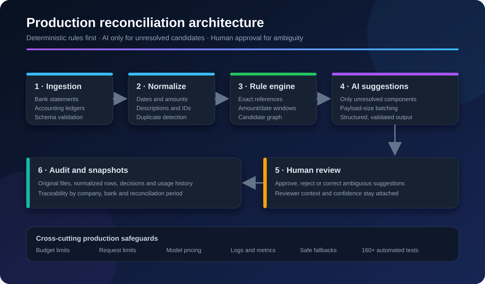
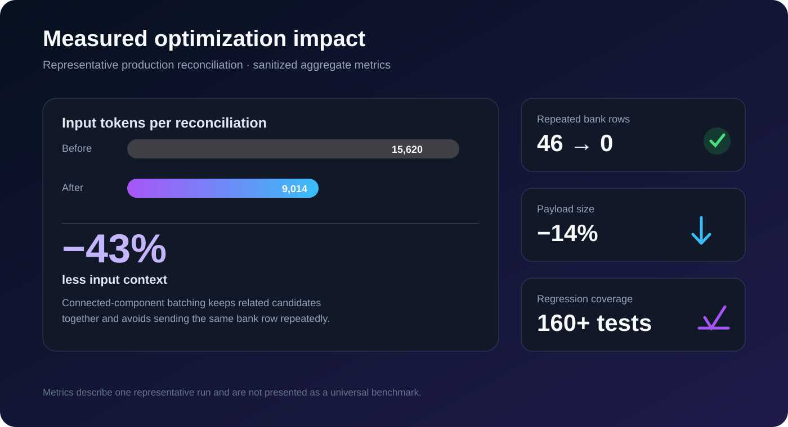
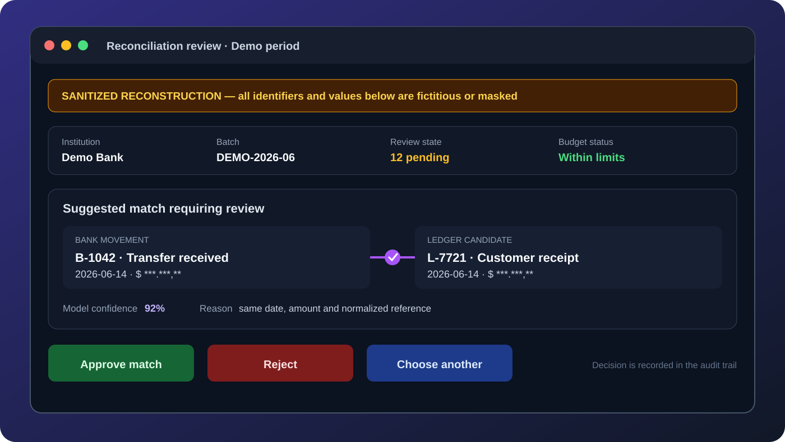

# Production AI-Assisted Bank Reconciliation

Sanitized technical case study. It contains no company data, credentials, proprietary source code, bank records, or customer information.

## Context

Bank reconciliation across several institutions is difficult because exported statements and accounting ledgers use different schemas, descriptions, date formats, identifiers, and balance conventions. A reliable solution must normalize those sources, preserve traceability, automate obvious matches, and keep ambiguous decisions under human control.

The production workflow described here supports six Argentine banks and combines deterministic matching with AI-assisted suggestions.

## My role

I designed and implemented the backend architecture, data model, import and normalization pipeline, matching rules, AI-assisted workflow, review states, metrics, cost controls, and production safeguards.

## Architecture

The diagram shows the control boundary: deterministic logic resolves predictable cases, the model only proposes matches for unresolved candidates, and a human owns ambiguous financial decisions.

1. **Ingestion and validation**  
   Each uploaded statement or ledger file is identified, validated against its expected institution, and rejected when its structure is incompatible.

2. **Normalization**  
   Dates, amounts, descriptions, identifiers, and balances are converted into a consistent internal representation. Duplicate detection prevents the same movement from entering the workflow twice.

3. **Deterministic matching**  
   Exact and rule-based candidates are resolved first. This reduces cost and ensures that predictable accounting rules do not depend on a language model.

4. **AI-assisted suggestions**  
   Only unresolved candidates are sent to the model. The model proposes matches, but it cannot finalize an ambiguous reconciliation without human review.

5. **Review and audit trail**  
   Every decision keeps its status, source, confidence, reviewer context, and relationship to the original files. Snapshots preserve the state of each reconciliation period.

6. **Production safeguards**  
   Usage history is preserved independently from the original reconciliation run. Model-specific pricing, monthly cost limits, request-count limits, logs, validations, and safe fallbacks prevent uncontrolled execution.

## Optimization

The first batching strategy split work by a fixed number of ledger rows. The same bank movement could appear in multiple batches when it was a candidate for several entries, causing duplicated context and unnecessary token usage.

I redesigned batching around connected components in the candidate graph. Related ledger entries and bank movements remain in the same request, and batch limits are based on payload size instead of an arbitrary row count.

Results from a representative production reconciliation:

- Input tokens: **15,620 → 9,014 (-43%)**
- Repeated bank rows: **46 → 0**
- Payload size: **-14%**
- Automated test suite: **160+ tests**
- AI budget protection: cost-based and request-count limits

## Sanitized review experience

*Reconstructed interface with fictitious identifiers and masked values. It illustrates the reviewer workflow without exposing production records.*

## Reliability principles

- Deterministic rules before model inference
- Human review for ambiguous financial decisions
- Immutable usage history for accurate cost accounting
- Model-specific pricing instead of a global estimate
- Explicit limits and disabled-by-default automated sweeps
- Tests for matching, imports, budgets, retries, and edge cases
- No sensitive records in logs, documentation, or public artifacts

## Stack

Python, Django, Django REST Framework, PostgreSQL, Celery, Redis, Gemini, Docker, Nginx, Dokploy, MinIO/S3, Pandas, and openpyxl.

## Outcome

The result is a traceable, maintainable reconciliation workflow that reduces manual review while preserving accounting control. The main lesson is that production AI is not only a model problem: data quality, deterministic validation, observability, budget controls, human review, and safe failure modes are part of the product.
