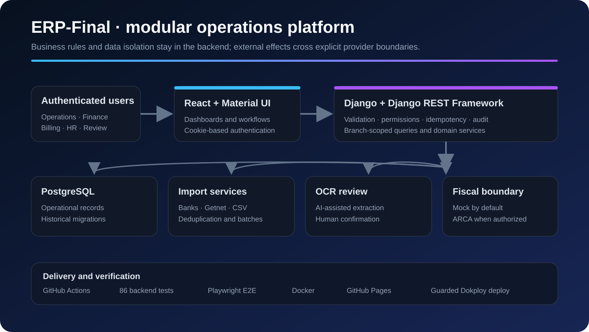

# ERP-Final: Operations, Finance & HR Platform

Sanitized engineering case study. Public images use synthetic demonstration data and expose no credentials, production records, certificates, or customer information.

## Context

Operational and financial data was spread across spreadsheets, bank exports and isolated administrative workflows. The platform had to consolidate those sources without losing historical relationships, branch isolation or human control over sensitive accounting decisions.

## My role

I designed and implemented backend services, data models, APIs, migrations, import workflows, validation rules, authentication, frontend flows, automated tests and deployment pipelines across Django, React and PostgreSQL.

## Architecture

The backend owns validation, permissions, idempotency and domain rules. React presents authenticated workflows, while PostgreSQL preserves operational state and historical migrations. OCR and fiscal behavior sit behind explicit service boundaries so uncertain or unauthorized operations cannot silently affect production.

## Sanitized product views

The following screenshots use synthetic demonstration data.

*Multi-bank dashboard for period-scoped income, expenses and transaction summaries.*

*Accounts-receivable review with status filters, transaction history and partial-payment tracking.*

## Engineering highlights

- 86 backend tests covering calculations, imports, billing, payroll, OCR, migrations and branch isolation
- Playwright end-to-end coverage for critical frontend flows
- Idempotent Getnet and bank-import processing
- Human review for ambiguous OCR, payment and identity matches
- Cookie-based JWT authentication with rotating refresh flow
- Fiscal authorization isolated behind a provider boundary; the mock provider remains the safe default
- CI-backed frontend publishing and guarded backend deployment

## Product scope

- Sales, weighing, expenses and branch-level reporting
- Bank-statement imports and financial dashboards
- Customer accounts, aliases, partial payments and collections
- Billing previews, Getnet imports and review-required payments
- Payroll, employee movements and remuneration summaries
- OCR-assisted voucher batches with traceable human review

## Stack

Python, Django 5, Django REST Framework, React 18, PostgreSQL, Material UI, Playwright, Docker and GitHub Actions.

## Public evidence

- [Source repository](https://github.com/MatiViglianco/ERP-Final)
- [Professional portfolio](https://mativiglianco.github.io/portfolio-astro/)
